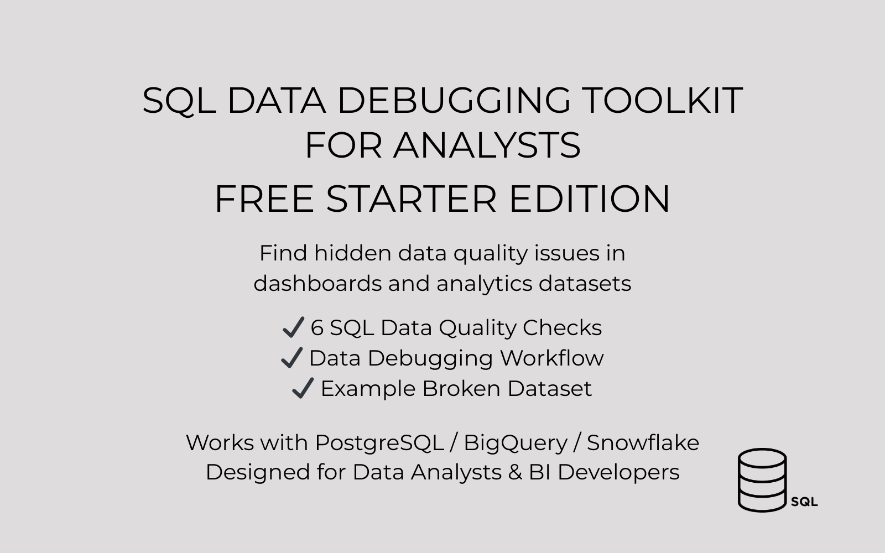
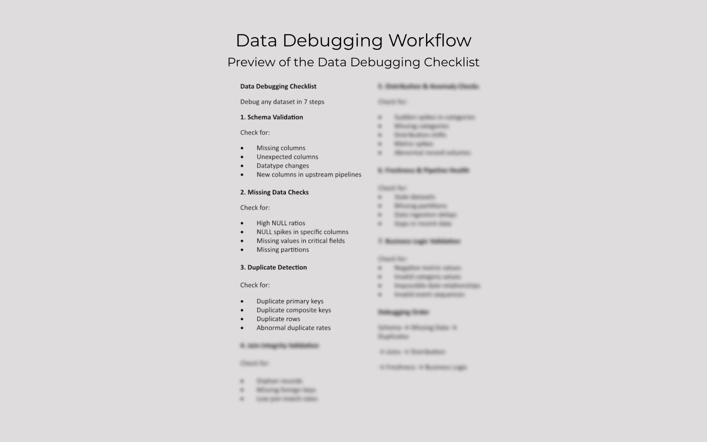
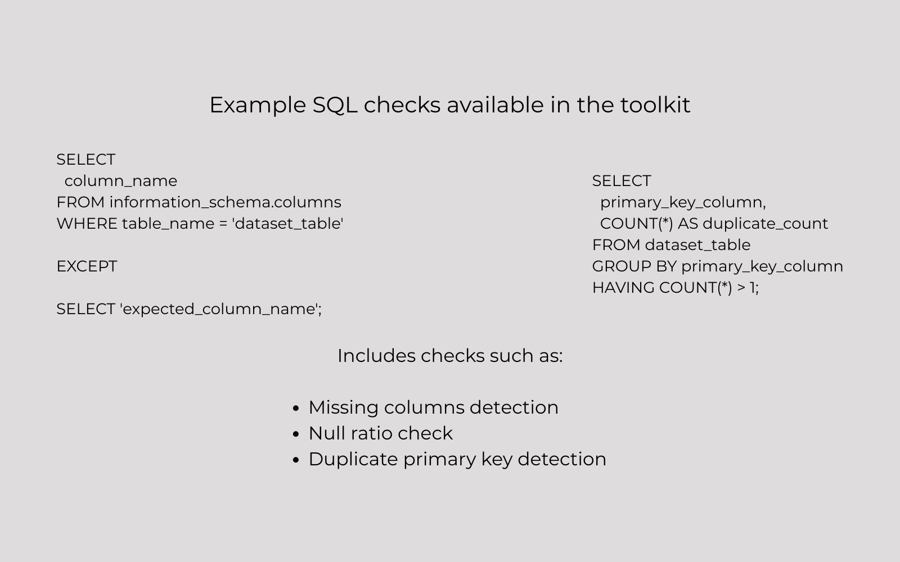
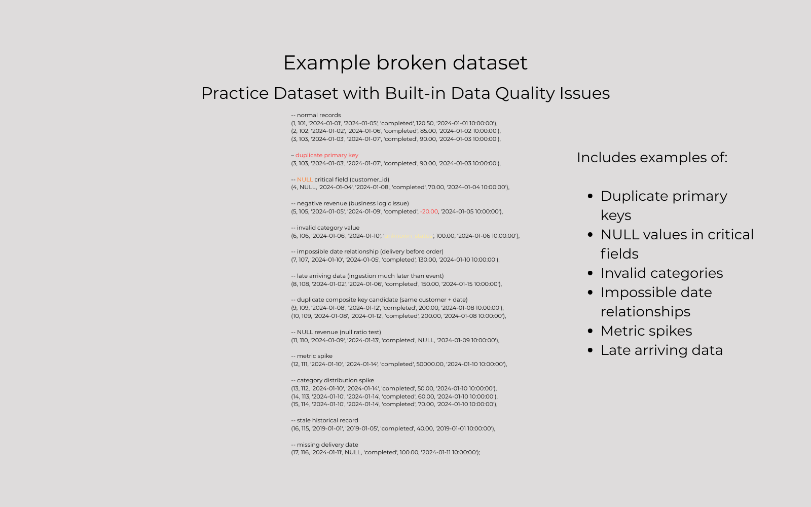

# SQL Data Debugging Toolkit



A practical SQL toolkit for detecting hidden data quality issues in analytics datasets.

This repository contains the **free starter edition** of the SQL Data Debugging Toolkit.

It includes a small set of SQL validation checks, a structured debugging workflow and an example dataset with built-in data issues.

---

# The Problem

Most data issues in analytics systems are **not caused by SQL mistakes**, but by hidden problems in datasets and pipelines.



Common examples:

• broken joins
• duplicate records
• missing values
• unexpected schema changes
• metric spikes
• late arriving data

When a dashboard suddenly shows incorrect numbers, analysts often start writing random queries to investigate the issue.

This toolkit provides a **structured approach to debugging analytics datasets.**

---

# What’s included in the free starter version

The starter edition includes:

• 6 SQL data validation checks
• Data debugging checklist (PDF)
• Example dataset with built-in data quality issues

These checks demonstrate the **debugging framework used in the full toolkit.**

---

# Example SQL check

Example query for detecting duplicate primary keys:

```sql
SELECT
    primary_key_column,
    COUNT(*) AS duplicate_count
FROM dataset_table
GROUP BY primary_key_column
HAVING COUNT(*) > 1;
```



---

# Debugging workflow

The toolkit follows a structured debugging workflow used by analytics teams:

1. Schema validation
2. Missing data checks
3. Duplicate detection
4. Join integrity validation
5. Distribution & anomaly detection
6. Data freshness checks
7. Business logic validation

This process helps analysts **isolate the root cause of data issues faster.**

---

# Repository structure

```id="mfk8zw"
sql-data-debugging-toolkit

starter
│
├── SQL_checks
│   ├── 01_schema_missing_columns.sql
│   ├── 03_null_ratio_check.sql
│   ├── 05_duplicate_primary_key.sql
│   ├── 15_orphan_records.sql
│   ├── 20_metric_spike_detection.sql
│   └── 27_negative_values_check.sql
│
├── example_dataset.sql
├── data_debugging_checklist.pdf
└── README.md
```



---

# Supported databases

The SQL queries follow **ANSI SQL principles** and should work with most modern warehouses:

• PostgreSQL
• Snowflake
• BigQuery
• Redshift
• DuckDB
• SQL Server

---

# Full Toolkit

The full SQL Data Debugging Toolkit includes:

• 30 SQL validation checks
• additional debugging templates
• extended documentation
• a complete data debugging workflow

Full version available here:

SQL Data Debugging Toolkit (Full Version)

---

# Author

Created by **Mikolaj Burzykowski**

I build practical tools for data analysts, including SQL debugging workflows, Excel dashboards and data validation systems.
